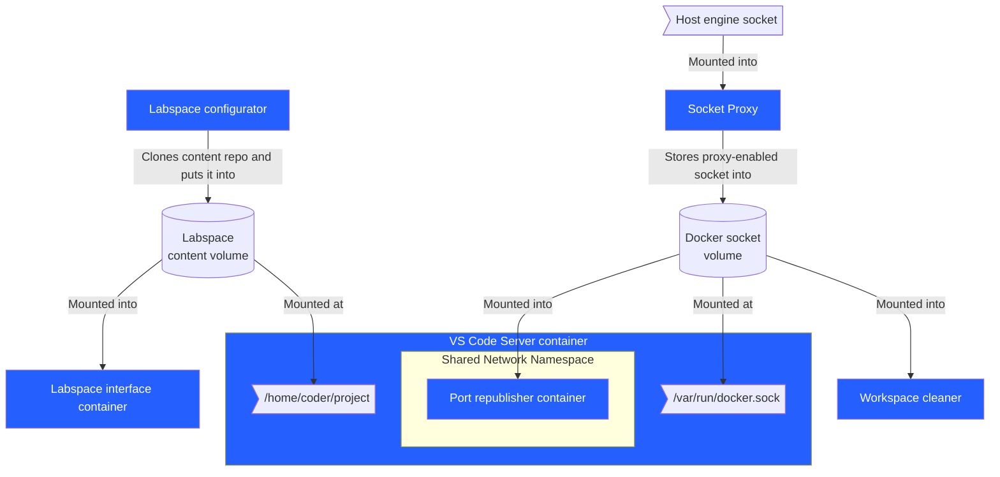

# ❓ What is a Labspace?

A Labspace is a collection of containerized services that provide participants with an isolated Docker workshop environment. It provides a web-based interface to a real Docker environment running in containers, with sophisticated backend services handling isolation and user experience.

And guess what? You're in a Labspace right now! 🎉

Simply put, there's more than just the VS Code Server with a split-screen interface. In order to provide the environment we want to have, we need a Docker Socket proxy, port republishing, and more. This Labspace will introduce you to each of these elements.

## 🏛️ The Labspace architecture

A Labspace is composed of many components, some of which you'll dive deep in with throughout this Labspace.

The key concept is the following:

1. 🧩 **The infrastructure.** This includes the IDE, configurator, port republisher, and other components. These components are maintained by the Labspace team.
2. 📝 **The content.** This includes the actual materials a participant reads (such as this text) and any relevant application code.

The **content** is stored in its own GitHub repository, such as the [mikesir87/labspace-about-labspaces](https://github.com/mikesir87/labspace-about-labspaces) repo that stores this content.

A Compose file is used to connect the _content_ with the _infrastructure_. By using this approach, **a published Compose file can fully encapsulate and configure a Labspace**.

The following Compose snippet shows how the content is merely an environment variable for the _configurator_ service. This service will clone the repo and place it into a volume that is then shared with all the other services:

```yaml
services:
  configurator:
    image: michaelirwin244/labspace-configurator
    volumes:
      - project:/project
    environment:
      PROJECT_CLONE_URL: https://github.com/mikesir87/labspace-about-labspaces

  interface:
    ...

  workspace:
    ...

  host-republisher:
    ...

  workspace-cleaner:
    ...

  socket-proxy:
    ...

volumes:
  socket-proxy:
    name: labspace-socket-proxy
  project:
    name: labspace-content

networks:
  default:
    name: labspace
```

### The Labspace components

Beyond the configurator, there are quite a few other services.

The following architecture diagram captures these components and how they work with each other.



Let's dive into how they are used to help create the Labspace environment.
